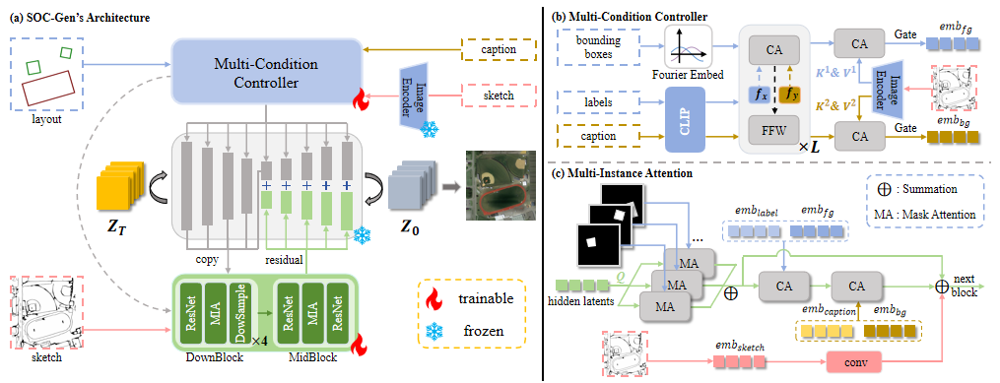
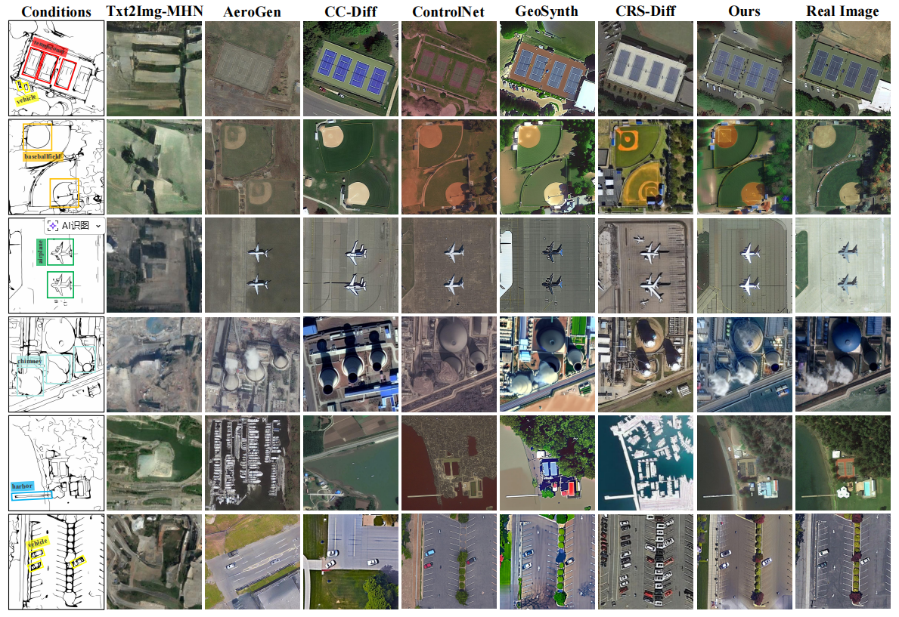
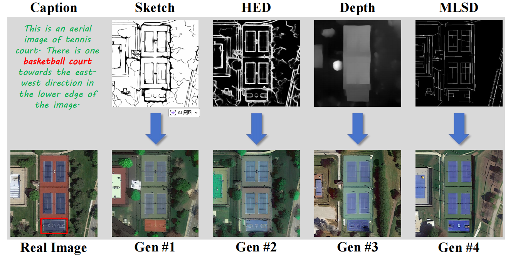
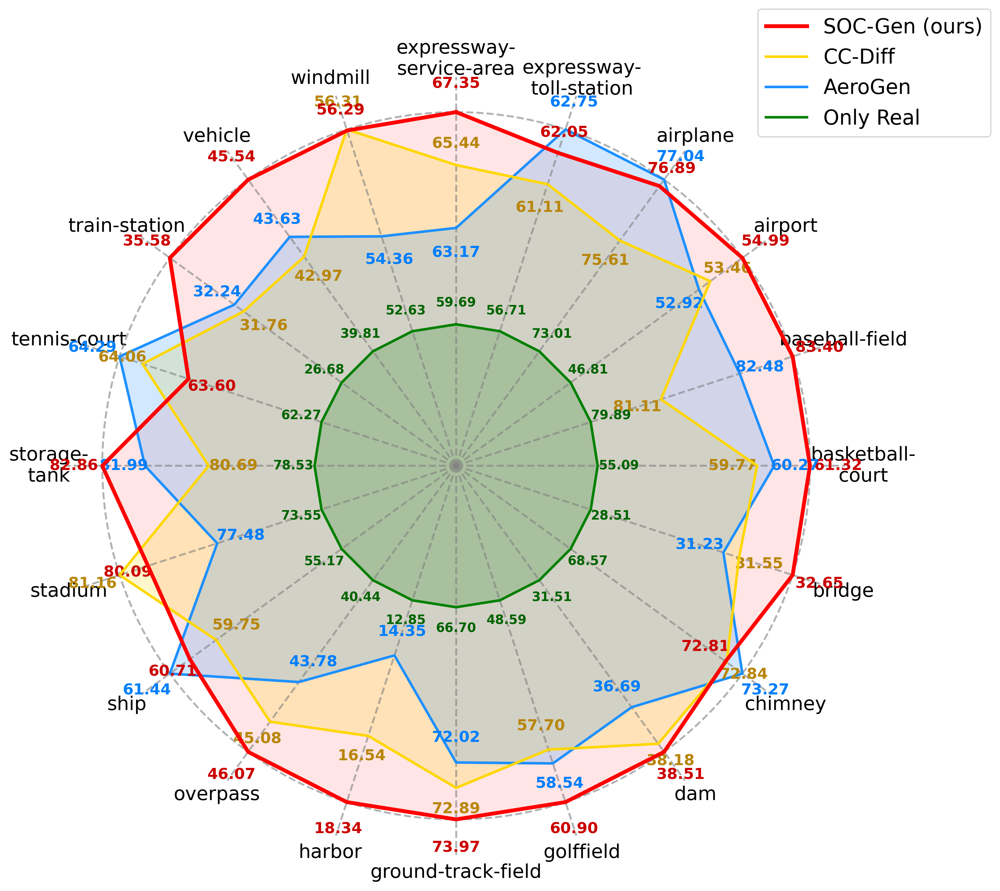

# SOC-Gen: Structurally Consistent and Object-Aware Multi-Condition Remote Sensing Image Generation

# TODO

- [X] Release inference code.
- [ ] Release pretrained weights.
- [ ] Release training code.

Training weights and the rest of the code will be coming soon.

# Overview

* The Architecture of our SOC-Gen.
<div align=center>

</div>

Overview of our SOC-Gen. (a) The Architecture of SOC-Gen. The model receives three inputs: caption, layout, and sketch. (b)
Architecture of Multi-Condition Controller. (c) The details of Object Enhancement Attention, which is the key component of our proposed
Object-Aware ControlNet.

* Comparison between our SOC-Gen and other methods.
<div align=center>

</div>

* Comparisons between the generated images of our SOC-Gen by replacing the original sketch with other control conditions.
<div align=center>

</div>

* <strong>Class-specific performance</strong> in the object detection task with <strong>YOLOv8</strong> using different data synthesis methods.
<div align=center>

</div>


## Environments

You can use the following commands to create a environment for SOC-Gen:
```bash
conda env create -f environment.yaml
conda activate socgen
```

## Inference

You can run the following code to generate image quickly:
```bash
CUDA_VISIBLE_DEVICES=0 python inference.py
```

# Acknowledgements
* Our work is based on [CC-Diff](https://github.com/AZZMM/CC-Diff) and [ControlNet](https://github.com/lllyasviel/ControlNet), we are deeply grateful for their outstanding contributions.
* We also sincerely thank [Txt2Img-MHN](https://github.com/YonghaoXu/Txt2Img-MHN), [AeroGen](https://github.com/Sonettoo/AeroGen), [CRS-Diff](https://github.com/Sonettoo/CRS-Diff), and [GeoSynth](https://github.com/mvrl/GeoSynth) for their open-source contributions to the remote sensing image generation community.

# Citation