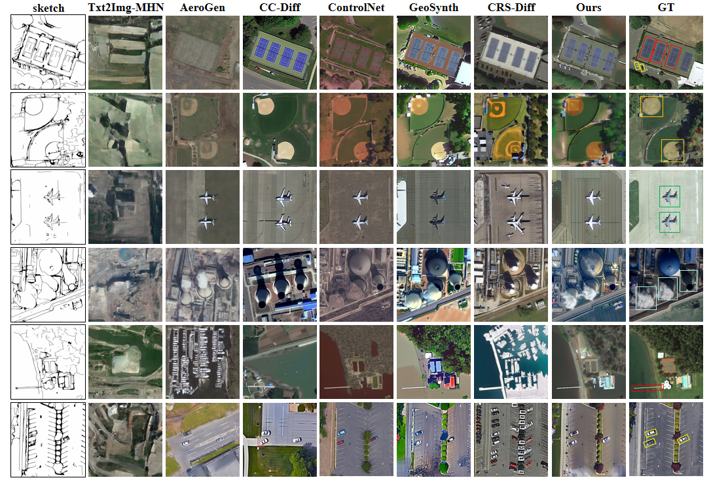

# SOC-Gen: Structurally Consistent and Object-Aware Multi-Condition Remote Sensing Image Generation

# TODO

- [X] Release inference code.
- [ ] Release pretrained weights.
- [ ] Release training code.

Training weights and the rest of the code will be coming soon.

# Overview

* SOC-Gen's Architecture
<div align=center>

</div>

* Qualitative Results On DIOR-RSVG
<div align=center>

</div>

* Generation under different control conditions from the same source image.
<div align=center>

</div>

## Environments

```bash
conda env create -f environment.yaml
conda activate socgen
```

## Inference

```bash
CUDA_VISIBLE_DEVICES=0 python inference.py
```

# Acknowledgements
Our work is based on [CC-Diff](https://github.com/AZZMM/CC-Diff) and [ControlNet](https://github.com/lllyasviel/ControlNet), we are deeply grateful for their outstanding contributions.

# Citation